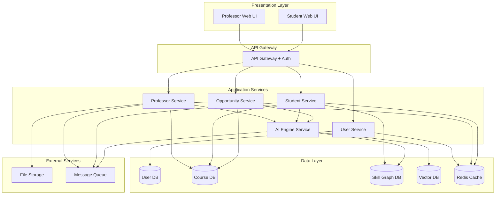

# Design Document: LEO Platform

## Overview

The LEO (Learning Engine for Opportunities) platform is built as a microservices-based architecture that separates concerns into distinct, scalable services. The system integrates AI capabilities through a centralized AI Engine that provides NLP, RAG, and recommendation services to both professor and student-facing modules.

The architecture follows a three-tier pattern:
- **Presentation Layer**: Web-based interfaces for professors and students
- **Application Layer**: Microservices handling business logic (User Service, Professor Service, Student Service, AI Engine)
- **Data Layer**: Distributed databases optimized for different data types (relational for structured data, vector database for embeddings, graph database for skill relationships)

Key design principles:
- **Modularity**: Each service can be developed, deployed, and scaled independently
- **API-First**: All services communicate through well-defined REST APIs
- **Asynchronous Processing**: Long-running AI operations use message queues to prevent blocking
- **Caching**: Frequently accessed data (skill graphs, user profiles) are cached for performance
- **Security by Design**: Authentication, authorization, and encryption at every layer

## Architecture

### System Components



### Service Responsibilities

**API Gateway**
- Request routing and load balancing
- JWT-based authentication and authorization
- Rate limiting and request throttling
- API versioning management

**User Service**
- User registration and authentication
- Profile management
- Role-based access control
- Session management

**Professor Service**
- Syllabus upload and storage
- Assignment and quiz management
- Analytics dashboard data aggregation
- Research recommendation retrieval

**Student Service**
- Skill profile management
- Learning path generation coordination
- Performance tracking and visualization
- Opportunity matching coordination

**AI Engine Service**
- Syllabus parsing using NLP
- Assignment and quiz generation
- RAG-based doubt resolution
- Skill graph traversal and analysis
- Recommendation scoring and ranking

**Opportunity Service**
- Opportunity data ingestion and storage
- Opportunity matching algorithm
- Career pathway generation
- Application tracking

### Data Flow Examples

**Syllabus Upload and Parsing Flow**
1. Professor uploads syllabus via Professor UI
2. API Gateway authenticates and routes to Professor Service
3. Professor Service stores file in File Storage and publishes parse request to Message Queue
4. AI Engine Service consumes message, downloads file, and parses content
5. AI Engine extracts topics, objectives, and stores structured data in Course DB
6. AI Engine publishes completion event
7. Professor Service updates syllabus status and notifies professor

**Student Doubt Resolution Flow**
1. Student submits question via Student UI
2. API Gateway routes to Student Service
3. Student Service forwards to AI Engine Service with course context
4. AI Engine retrieves relevant embeddings from Vector DB
5. AI Engine generates response using RAG with retrieved context
6. Response returned to student with confidence score
7. Student Service logs interaction for feedback learning

## Components and Interfaces

### User Service API

```typescript
// Authentication
POST /api/v1/auth/register
Request: { email: string, password: string, role: "professor" | "student", name: string }
Response: { userId: string, token: string }

POST /api/v1/auth/login
Request: { email: string, password: string }
Response: { userId: string, token: string, role: string }

POST /api/v1/auth/logout
Request: { token: string }
Response: { success: boolean }

// Profile Management
GET /api/v1/users/{userId}
Response: { userId: string, email: string, name: string, role: string, createdAt: string }

PUT /api/v1/users/{userId}
Request: { name?: string, email?: string }
Response: { userId: string, updated: boolean }

DELETE /api/v1/users/{userId}
Response: { success: boolean }
```

### Professor Service API

```typescript
// Syllabus Management
POST /api/v1/syllabi
Request: FormData { file: File, courseId: string, courseName: string }
Response: { syllabusId: string, status: "processing" | "completed" | "failed" }

GET /api/v1/syllabi/{syllabusId}
Response: { 
  syllabusId: string, 
  courseId: string,
  topics: string[], 
  objectives: string[],
  assessmentCriteria: string[],
  status: string 
}

// Assignment Generation
POST /api/v1/assignments/generate
Request: { syllabusId: string, topicIds: string[], count: number }
Response: { assignments: Assignment[] }

PUT /api/v1/assignments/{assignmentId}
Request: { title?: string, description?: string, questions?: Question[] }
Response: { assignmentId: string, updated: boolean }

// Analytics
GET /api/v1/analytics/class/{courseId}
Response: {
  averageScore: number,
  completionRate: number,
  topicPerformance: { topicId: string, averageScore: number }[],
  knowledgeGaps: { topicId: string, affectedStudentPercentage: number }[]
}

// Research Recommendations
GET /api/v1/research/recommendations/{syllabusId}
Response: {
  recommendations: {
    paperId: string,
    title: string,
    authors: string[],
    venue: string,
    relevanceScore: number
  }[]
}
```

### Student Service API

```typescript
// Skill Profile
POST /api/v1/students/{studentId}/skills
Request: { skills: string[], interests: string[], goals: string[] }
Response: { profileId: string, created: boolean }

GET /api/v1/students/{studentId}/skills
Response: {
  skills: { skillId: string, name: string, level: number, lastUpdated: string }[],
  interests: string[],
  goals: string[]
}

PUT /api/v1/students/{studentId}/skills
Request: { skills?: string[], interests?: string[], goals?: string[] }
Response: { profileId: string, updated: boolean }

// Learning Path
GET /api/v1/students/{studentId}/learning-path
Response: {
  pathId: string,
  activities: {
    activityId: string,
    type: "reading" | "video" | "exercise" | "practice",
    title: string,
    skillTargets: string[],
    estimatedTime: number,
    completed: boolean
  }[],
  generatedAt: string
}

POST /api/v1/students/{studentId}/learning-path/complete
Request: { activityId: string }
Response: { updated: boolean, nextActivity: string }

// Performance Tracking
GET /api/v1/students/{studentId}/performance
Response: {
  overallScore: number,
  completionRate: number,
  skillProgression: { skillId: string, scores: { date: string, score: number }[] }[],
  weakTopics: string[]
}

// Doubt Resolution
POST /api/v1/students/{studentId}/questions
Request: { question: string, courseId: string, context?: string }
Response: {
  questionId: string,
  answer: string,
  confidence: number,
  sources: string[],
  suggestAlternatives: boolean
}
```

### AI Engine Service API

```typescript
// Syllabus Parsing
POST /api/v1/ai/parse-syllabus
Request: { fileUrl: string, syllabusId: string }
Response: {
  topics: string[],
  objectives: string[],
  assessmentCriteria: string[],
  extractedText: string
}

// Content Generation
POST /api/v1/ai/generate-assignments
Request: { syllabusId: string, topics: string[], count: number }
Response: {
  assignments: {
    title: string,
    description: string,
    questions: { question: string, type: string, points: number }[]
  }[]
}

POST /api/v1/ai/generate-quiz
Request: { syllabusId: string, topics: string[] }
Response: {
  quiz: {
    questions: {
      question: string,
      options: string[],
      correctAnswer: number,
      topic: string
    }[]
  }
}

// RAG-based Q&A
POST /api/v1/ai/answer-question
Request: { question: string, courseId: string, context: string[] }
Response: {
  answer: string,
  confidence: number,
  retrievedChunks: string[],
  sources: string[]
}

// Skill Graph Operations
GET /api/v1/ai/skill-graph/path
Request: { fromSkill: string, toSkill: string }
Response: { path: string[], prerequisites: string[] }

POST /api/v1/ai/skill-graph/analyze
Request: { currentSkills: string[], targetSkills: string[] }
Response: { gaps: string[], learningSequence: string[] }

// Recommendations
POST /api/v1/ai/recommend-opportunities
Request: { studentProfile: object, preferences: object }
Response: {
  opportunities: {
    opportunityId: string,
    title: string,
    relevanceScore: number,
    matchedSkills: string[]
  }[]
}
```

### Opportunity Service API

```typescript
// Opportunity Management
GET /api/v1/opportunities
Query: { type?: string, skills?: string[], page: number, limit: number }
Response: {
  opportunities: {
    opportunityId: string,
    title: string,
    organization: string,
    type: "internship" | "scholarship" | "research" | "job",
    requirements: string[],
    deadline: string,
    description: string
  }[],
  total: number
}

GET /api/v1/opportunities/{opportunityId}
Response: { /* full opportunity details */ }

// Career Pathways
GET /api/v1/career-pathways
Request: { studentId: string }
Response: {
  pathways: {
    pathwayId: string,
    title: string,
    requiredSkills: string[],
    roles: string[],
    progressionSteps: string[],
    skillGaps: string[]
  }[]
}
```

## Data Models

### User Model
```typescript
interface User {
  userId: string;           // UUID
  email: string;            // Unique, indexed
  passwordHash: string;     // bcrypt hashed
  name: string;
  role: "professor" | "student";
  createdAt: Date;
  updatedAt: Date;
  lastLogin: Date;
}
```

### Professor Profile Model
```typescript
interface ProfessorProfile {
  professorId: string;      // References User.userId
  department: string;
  researchInterests: string[];
  courses: string[];        // Array of courseIds
}
```

### Student Profile Model
```typescript
interface StudentProfile {
  studentId: string;        // References User.userId
  skills: Skill[];
  interests: string[];
  goals: string[];
  enrolledCourses: string[]; // Array of courseIds
  completedCourses: string[];
}

interface Skill {
  skillId: string;
  name: string;
  level: number;            // 0-100 proficiency
  lastUpdated: Date;
  source: "self-reported" | "assessed" | "inferred";
}
```

### Syllabus Model
```typescript
interface Syllabus {
  syllabusId: string;       // UUID
  courseId: string;
  professorId: string;
  fileName: string;
  fileUrl: string;          // Storage location
  uploadedAt: Date;
  status: "processing" | "completed" | "failed";
  parsedData: ParsedSyllabusData;
}

interface ParsedSyllabusData {
  courseName: string;
  topics: Topic[];
  learningObjectives: string[];
  assessmentCriteria: string[];
  prerequisites: string[];
  extractedText: string;
}

interface Topic {
  topicId: string;
  name: string;
  description: string;
  weekNumber?: number;
  relatedSkills: string[];  // References Skill Graph
}
```

### Assignment Model
```typescript
interface Assignment {
  assignmentId: string;     // UUID
  courseId: string;
  title: string;
  description: string;
  questions: Question[];
  createdBy: "ai" | "professor";
  createdAt: Date;
  dueDate?: Date;
  publishedToStudents: boolean;
}

interface Question {
  questionId: string;
  text: string;
  type: "multiple-choice" | "short-answer" | "essay" | "coding";
  options?: string[];       // For multiple-choice
  correctAnswer?: string | number;
  points: number;
  topicId: string;
}
```

### Student Submission Model
```typescript
interface Submission {
  submissionId: string;     // UUID
  assignmentId: string;
  studentId: string;
  answers: Answer[];
  submittedAt: Date;
  score?: number;
  feedback?: string;
  gradedAt?: Date;
}

interface Answer {
  questionId: string;
  response: string;
  isCorrect?: boolean;
  pointsEarned?: number;
}
```

### Learning Path Model
```typescript
interface LearningPath {
  pathId: string;           // UUID
  studentId: string;
  generatedAt: Date;
  activities: LearningActivity[];
  completionPercentage: number;
}

interface LearningActivity {
  activityId: string;
  type: "reading" | "video" | "exercise" | "practice";
  title: string;
  description: string;
  resourceUrl?: string;
  skillTargets: string[];   // Skills this activity develops
  estimatedTime: number;    // Minutes
  completed: boolean;
  completedAt?: Date;
  order: number;            // Sequence in path
}
```

### Skill Graph Model
```typescript
interface SkillNode {
  skillId: string;          // UUID
  name: string;
  description: string;
  category: string;         // e.g., "programming", "mathematics", "communication"
  level: "beginner" | "intermediate" | "advanced";
}

interface SkillEdge {
  fromSkillId: string;
  toSkillId: string;
  relationshipType: "prerequisite" | "related" | "advanced-version";
  strength: number;         // 0-1, how strong the relationship is
}
```

### Opportunity Model
```typescript
interface Opportunity {
  opportunityId: string;    // UUID
  title: string;
  organization: string;
  type: "internship" | "scholarship" | "research" | "job";
  description: string;
  requirements: string[];
  requiredSkills: string[]; // References Skill Graph
  deadline: Date;
  location: string;
  isRemote: boolean;
  applicationUrl: string;
  createdAt: Date;
  expiresAt: Date;
}
```

### Student Opportunity Tracking Model
```typescript
interface OpportunityTracking {
  trackingId: string;       // UUID
  studentId: string;
  opportunityId: string;
  status: "saved" | "applied" | "interviewing" | "accepted" | "rejected";
  savedAt: Date;
  appliedAt?: Date;
  notes?: string;
}
```

### Question Log Model (for RAG)
```typescript
interface QuestionLog {
  logId: string;            // UUID
  studentId: string;
  courseId: string;
  question: string;
  answer: string;
  confidence: number;
  retrievedChunks: string[];
  feedbackRating?: number;  // 1-5 stars
  feedbackText?: string;
  askedAt: Date;
}
```

### Analytics Aggregation Model
```typescript
interface ClassAnalytics {
  analyticsId: string;      // UUID
  courseId: string;
  calculatedAt: Date;
  studentCount: number;
  averageScore: number;
  completionRate: number;
  topicPerformance: TopicPerformance[];
  knowledgeGaps: KnowledgeGap[];
}

interface TopicPerformance {
  topicId: string;
  topicName: string;
  averageScore: number;
  studentCount: number;
  assessmentCount: number;
}

interface KnowledgeGap {
  topicId: string;
  topicName: string;
  affectedStudentCount: number;
  affectedStudentPercentage: number;
  averageDeficit: number;   // How far below expected performance
}
```


## Correctness Properties

*A property is a characteristic or behavior that should hold true across all valid executions of a system—essentially, a formal statement about what the system should do. Properties serve as the bridge between human-readable specifications and machine-verifiable correctness guarantees.*

### Authentication and Authorization Properties

**Property 1: User Registration Validation**
*For any* registration attempt, the system should create an account with encrypted password if credentials are valid and unique, or reject with appropriate error if email already exists or credentials are invalid.
**Validates: Requirements 1.1, 1.2**

**Property 2: Authentication Correctness**
*For any* login attempt, the system should grant access if and only if the provided credentials match stored credentials, and should reject all invalid credential combinations.
**Validates: Requirements 1.3, 1.4**

**Property 3: Role Assignment Invariant**
*For any* user account, the user should have exactly one role (Professor or Student) at all times after registration.
**Validates: Requirements 1.5**

**Property 4: Authorization Enforcement**
*For any* feature access attempt, the system should grant access if and only if the user's role has the required permissions for that feature.
**Validates: Requirements 1.6**

### Syllabus Management Properties

**Property 5: File Upload Validation**
*For any* file upload attempt, the system should accept and store the file if it is in PDF or DOCX format, and reject with error message if the format is unsupported.
**Validates: Requirements 2.1, 2.2**

**Property 6: Syllabus Parsing Correctness**
*For any* valid syllabus file, parsing should extract structured data (topics, objectives, assessment criteria) that can be successfully stored and retrieved.
**Validates: Requirements 2.3, 2.5**

**Property 7: Parsing Error Handling**
*For any* syllabus parsing failure, the system should notify the professor with error details and maintain system stability.
**Validates: Requirements 2.4**

### Content Generation Properties

**Property 8: Assignment Generation Requirements**
*For any* parsed syllabus, assignment generation should produce at least 3 unique assignments aligned with course learning objectives, where uniqueness means no duplicate questions across generations.
**Validates: Requirements 3.1, 3.4**

**Property 9: Quiz Topic Coverage**
*For any* parsed syllabus with N major topics, quiz generation should produce questions covering all N topics.
**Validates: Requirements 3.2**

**Property 10: Content Edit Persistence**
*For any* generated assignment or quiz, professor edits should be persisted such that retrieving the content returns the edited version.
**Validates: Requirements 3.5**

### Analytics Properties

**Property 11: Analytics Calculation Correctness**
*For any* set of student assessment data, calculated analytics (average scores, completion rates, topic performance, knowledge gaps) should accurately reflect the underlying data according to defined formulas.
**Validates: Requirements 4.1, 4.2, 4.4**

**Property 12: Analytics Filtering Correctness**
*For any* analytics filter (time period, student cohort, topic), the filtered results should contain only data matching the filter criteria.
**Validates: Requirements 4.5**

### Research Recommendation Properties

**Property 13: Research Recommendation Relevance**
*For any* syllabus with defined topics, research recommendations should be relevant to those topics according to the relevance scoring function.
**Validates: Requirements 5.1**

**Property 14: Research Recommendation Structure**
*For any* research recommendation, it should include all required fields (title, authors, venue, relevance score) and there should be at least 5 recommendations per syllabus topic.
**Validates: Requirements 5.3, 5.5**

**Property 15: Research Feedback Effect**
*For any* research recommendation marked as relevant or irrelevant, future recommendations should reflect the feedback through adjusted weights.
**Validates: Requirements 5.4**

### Student Profile Properties

**Property 16: Skill Profile Mutation Correctness**
*For any* skill profile creation or update operation, the stored profile should exactly match the input data (skills, interests, goals).
**Validates: Requirements 6.1, 6.5**

**Property 17: Skill Taxonomy Validation**
*For any* skill entry, the system should accept it if and only if it exists in the predefined skill taxonomy.
**Validates: Requirements 6.2**

**Property 18: Assessment-Based Profile Update**
*For any* completed assessment, the student's skill profile should be updated to reflect demonstrated competencies based on assessment performance.
**Validates: Requirements 6.3**

**Property 19: Skill History Persistence**
*For any* skill profile, historical skill progression data should be maintained and retrievable, showing skill levels at different points in time.
**Validates: Requirements 6.4**

### RAG and Doubt Resolution Properties

**Property 20: RAG Response Completeness**
*For any* student question, the RAG system should generate a response that includes an answer, confidence score (0-1 range), and retrieved source references.
**Validates: Requirements 7.1, 7.3, 7.5**

**Property 21: RAG Content Retrieval Relevance**
*For any* student question with course context, retrieved content should be relevant to both the question and the course materials.
**Validates: Requirements 7.2**

**Property 22: RAG Low Confidence Fallback**
*For any* question where the RAG engine produces a confidence score below threshold, the system should suggest alternative resources or recommend contacting the professor.
**Validates: Requirements 7.4**

### Learning Path Properties

**Property 23: Learning Path Generation Completeness**
*For any* student skill profile with identified gaps, the generated learning path should include activities that address all identified skill gaps.
**Validates: Requirements 8.1**

**Property 24: Learning Path Prerequisite Ordering**
*For any* generated learning path, activities should be ordered such that prerequisite skills are addressed before advanced skills according to the Skill_Graph dependencies.
**Validates: Requirements 8.2**

**Property 25: Learning Path Update Correctness**
*For any* completed learning activity, the learning path should be updated to mark the activity as completed and adjust subsequent recommendations based on demonstrated progress.
**Validates: Requirements 8.3**

**Property 26: Learning Path Resource Diversity**
*For any* generated learning path with multiple activities, the path should include at least two different resource types (reading, video, exercise, practice).
**Validates: Requirements 8.5**

### Performance Tracking Properties

**Property 27: Performance Dashboard Completeness**
*For any* student with assessment data, the performance dashboard should display all required metrics (scores, completion rates, skill progression).
**Validates: Requirements 9.1**

**Property 28: Underperformance Identification**
*For any* student and topic, if the student's score is below the class average, the topic should be highlighted as underperforming.
**Validates: Requirements 9.3**

**Property 29: Benchmark Comparison Correctness**
*For any* student performance comparison, the class benchmarks should be correctly calculated and anonymized (no individual student identification possible).
**Validates: Requirements 9.5**

### Opportunity Recommendation Properties

**Property 30: Opportunity Matching Correctness**
*For any* student skill profile, recommended opportunities should match the student's skills, interests, and career goals according to the matching algorithm.
**Validates: Requirements 10.1**

**Property 31: Opportunity Ranking Correctness**
*For any* set of opportunity recommendations, they should be ranked in descending order by relevance score, where relevance is calculated from skill match percentage and student preferences.
**Validates: Requirements 10.2**

**Property 32: Opportunity Display Completeness**
*For any* displayed opportunity, it should include all required fields (title, organization, requirements, deadline, relevance score).
**Validates: Requirements 10.4**

**Property 33: Opportunity Tracking Persistence**
*For any* opportunity save or status update operation, the tracking data should be persisted and retrievable with the correct status.
**Validates: Requirements 10.5**

### Career Pathway Properties

**Property 34: Career Pathway Generation Requirements**
*For any* student skill profile, career pathway generation should produce at least 3 relevant pathways, each including required skills, typical roles, and progression steps.
**Validates: Requirements 11.1, 11.2**

**Property 35: Career Pathway Gap Analysis**
*For any* student profile and career pathway, the system should correctly identify skill gaps as the set difference between pathway requirements and current student skills.
**Validates: Requirements 11.3**

**Property 36: Gap-Bridging Recommendations**
*For any* identified skill gap, the system should recommend learning resources (courses, certifications) that teach the missing skills.
**Validates: Requirements 11.4**

**Property 37: Career Pathway Update Trigger**
*For any* significant skill profile change (defined as adding/removing skills or changing proficiency by >20 points), career pathway suggestions should be regenerated.
**Validates: Requirements 11.5**

### Skill Graph Properties

**Property 38: Skill Graph Structure Invariant**
*For any* state of the Skill_Graph, it should maintain the structure of skills as nodes and relationships (prerequisite, related, advanced) as edges, with no orphaned nodes.
**Validates: Requirements 12.1**

**Property 39: Skill Uniqueness Enforcement**
*For any* skill addition attempt, the system should reject it if a skill with the same identifier already exists in the graph.
**Validates: Requirements 12.2**

**Property 40: Skill Relationship Persistence**
*For any* prerequisite relationship defined between two skills, the relationship should be persisted and retrievable from the graph.
**Validates: Requirements 12.3**

**Property 41: Skill Graph Traversal Correctness**
*For any* learning path generation, the traversal should respect prerequisite edges such that no skill appears in the path before its prerequisites.
**Validates: Requirements 12.4**

**Property 42: Skill Graph Query Correctness**
*For any* query for related skills or learning sequences, the results should accurately reflect the graph structure and relationships.
**Validates: Requirements 12.5**

### Security Properties

**Property 43: Password Encryption Invariant**
*For any* user password, it should never be stored in plaintext—all stored passwords should be hashed using industry-standard algorithms (bcrypt, argon2).
**Validates: Requirements 14.1**

**Property 44: Sensitive Data Encryption**
*For any* sensitive user data (personal information, performance records), it should be encrypted both at rest (in database) and in transit (over network).
**Validates: Requirements 14.2**

**Property 45: Data Deletion Completeness**
*For any* user data deletion request, all associated personal data should be permanently removed from all system components.
**Validates: Requirements 14.4**

**Property 46: Access Logging Completeness**
*For any* data access attempt, an audit log entry should be created with timestamp, user, resource, and outcome.
**Validates: Requirements 14.5**

**Property 47: Role-Based Access Control Enforcement**
*For any* data access attempt, access should be granted if and only if the user's role has permissions for the requested resource.
**Validates: Requirements 14.6**

### API Properties

**Property 48: API Endpoint Completeness**
*For any* core functionality (authentication, syllabus management, recommendations), there should exist a corresponding RESTful API endpoint.
**Validates: Requirements 15.1**

**Property 49: API Error Handling**
*For any* malformed API request, the system should return an appropriate HTTP status code (4xx) and a descriptive error message.
**Validates: Requirements 15.3**

**Property 50: API Rate Limiting**
*For any* API client exceeding the rate limit threshold, subsequent requests should be rejected with HTTP 429 status until the rate limit window resets.
**Validates: Requirements 15.4**

### Feedback and Learning Properties

**Property 51: Recommendation Feedback Effect**
*For any* feedback provided on a recommendation (student or professor), the feedback should be recorded and should influence future recommendation weights in the same direction as the feedback.
**Validates: Requirements 16.1, 16.3**

**Property 52: Acceptance Rate Influence**
*For any* recommendation type, higher acceptance rates should result in increased relevance scores for similar future recommendations.
**Validates: Requirements 16.4**

**Property 53: Feedback History Persistence**
*For any* feedback provided, it should be stored in feedback history and remain retrievable for model performance analysis.
**Validates: Requirements 16.5**

## Error Handling

### Error Categories

**Authentication Errors**
- Invalid credentials: Return 401 Unauthorized with message "Invalid email or password"
- Duplicate registration: Return 409 Conflict with message "Email already registered"
- Expired session: Return 401 Unauthorized with message "Session expired, please login again"
- Insufficient permissions: Return 403 Forbidden with message "Insufficient permissions for this resource"

**Validation Errors**
- Invalid file format: Return 400 Bad Request with message "Unsupported file format. Please upload PDF or DOCX"
- Invalid skill: Return 400 Bad Request with message "Skill not found in taxonomy"
- Malformed request: Return 400 Bad Request with specific field validation errors
- Missing required fields: Return 400 Bad Request with list of missing fields

**Processing Errors**
- Syllabus parsing failure: Return 500 Internal Server Error, notify professor with error details, log for debugging
- AI generation failure: Return 500 Internal Server Error, log error, provide fallback or retry mechanism
- Database connection failure: Return 503 Service Unavailable, implement retry with exponential backoff
- External service timeout: Return 504 Gateway Timeout, log error, implement circuit breaker pattern

**Resource Errors**
- Resource not found: Return 404 Not Found with message "Resource not found"
- Resource already exists: Return 409 Conflict with message "Resource already exists"
- Resource deleted: Return 410 Gone with message "Resource has been deleted"

**Rate Limiting Errors**
- Rate limit exceeded: Return 429 Too Many Requests with Retry-After header

### Error Handling Strategies

**Graceful Degradation**
- If AI services are unavailable, disable AI-dependent features but keep core functionality operational
- If analytics calculation fails, show cached data with staleness indicator
- If recommendation engine fails, show previously generated recommendations

**Retry Mechanisms**
- Implement exponential backoff for transient failures (network issues, temporary service unavailability)
- Maximum 3 retry attempts for idempotent operations
- No automatic retry for non-idempotent operations (user must explicitly retry)

**Circuit Breaker Pattern**
- Implement circuit breakers for external service calls (AI Engine, File Storage)
- Open circuit after 5 consecutive failures
- Half-open state after 30 seconds to test recovery
- Close circuit after 2 consecutive successes

**Logging and Monitoring**
- Log all errors with severity levels (ERROR, WARN, INFO)
- Include correlation IDs for request tracing across services
- Alert on error rate thresholds (>5% error rate triggers alert)
- Monitor error patterns for proactive issue detection

## Testing Strategy

### Dual Testing Approach

The LEO platform requires both unit testing and property-based testing for comprehensive coverage:

**Unit Tests** focus on:
- Specific examples demonstrating correct behavior
- Edge cases (empty inputs, boundary values, special characters)
- Error conditions and exception handling
- Integration points between services
- Mock external dependencies for isolated testing

**Property-Based Tests** focus on:
- Universal properties that hold for all inputs
- Comprehensive input coverage through randomization
- Invariants that must be maintained across operations
- Round-trip properties (serialize/deserialize, encode/decode)
- Relationship properties between components

### Property-Based Testing Configuration

**Testing Library Selection**
- **TypeScript/JavaScript**: fast-check
- **Python**: Hypothesis
- **Java**: jqwik
- **Go**: gopter

**Test Configuration**
- Minimum 100 iterations per property test (due to randomization)
- Seed-based reproducibility for failed test cases
- Shrinking enabled to find minimal failing examples
- Timeout: 30 seconds per property test

**Property Test Tagging**
Each property-based test must include a comment tag referencing the design document property:
```typescript
// Feature: leo-platform, Property 1: User Registration Validation
```

**Coverage Requirements**
- Each correctness property (Properties 1-53) must be implemented by exactly one property-based test
- Unit tests should cover specific examples and edge cases not fully covered by properties
- Integration tests should verify end-to-end flows across multiple services

### Testing Pyramid

```
        /\
       /  \
      / E2E \          10% - End-to-end tests (critical user flows)
     /______\
    /        \
   /Integration\       20% - Integration tests (service interactions)
  /____________\
 /              \
/   Unit + PBT   \     70% - Unit tests + Property-based tests
/__________________\
```

### Test Data Generation

**For Property-Based Tests**
- Generate random valid users with various roles
- Generate random syllabus content with varying structures
- Generate random skill profiles with different gap patterns
- Generate random assessment data with various score distributions
- Generate random skill graphs with different topologies

**For Unit Tests**
- Use fixed test data for reproducibility
- Include edge cases: empty strings, null values, maximum lengths
- Include boundary values: minimum/maximum scores, dates
- Include special characters and Unicode in text fields

### Continuous Testing

**Pre-commit Hooks**
- Run unit tests for changed files
- Run linting and type checking

**CI/CD Pipeline**
- Run all unit tests on every commit
- Run property-based tests on every commit
- Run integration tests on pull requests
- Run E2E tests before deployment to staging
- Performance tests on staging environment

**Test Monitoring**
- Track test execution time trends
- Monitor flaky test rates
- Alert on test coverage drops below 80%
- Track property test failure patterns
